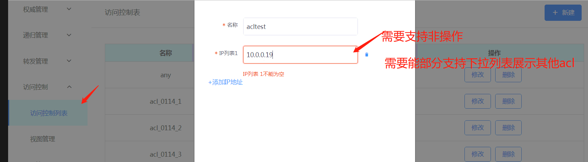
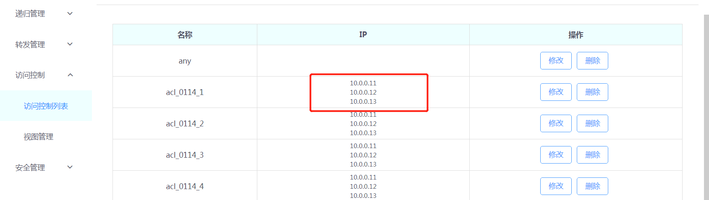
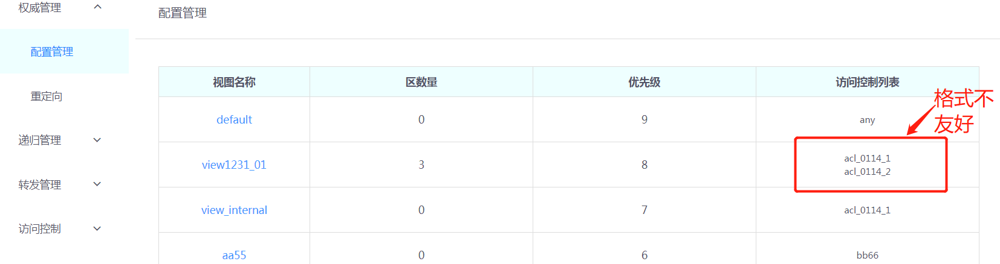
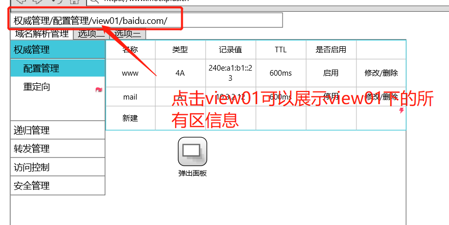
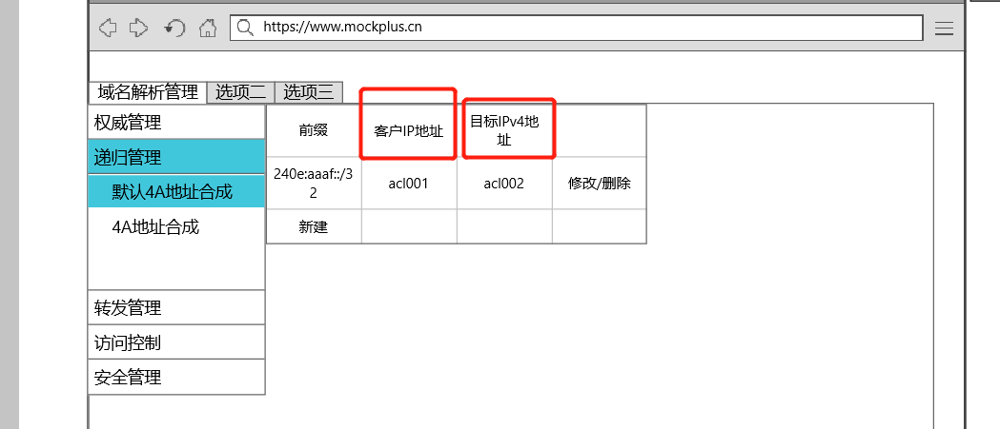
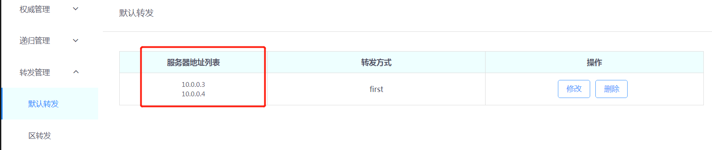
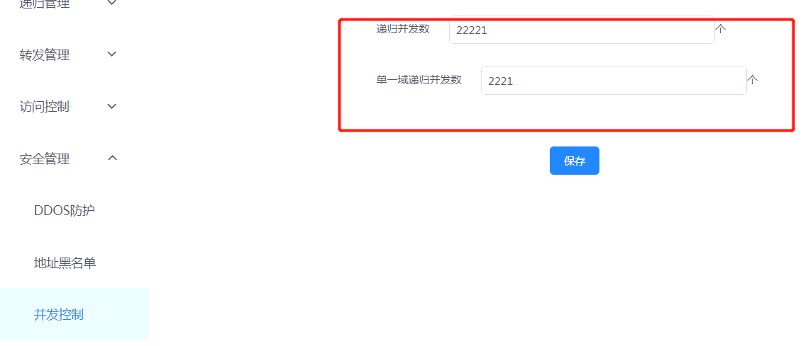

# 界面优化
## 访问控制=>访问控制列表
1. ip中的内容既可以是ip也可以是其他acl.无论是ip还是acl都需要支持非操作,目前并不支持非操作和下列表可选acl(吴昊,张仪).

2. 界面"IP"项的展示命名是否可以优化.IP内的内容列举了所有的ip.当ip数据量大的时候格式会有变化(吴昊,张仪).

## 权威管理=>配置管理
1. 访问控制列表的展示方式是否可以优化(吴昊,张仪).

## 多级访问的页面
1. 后退没有做好.不可选中间页面,如权威管理,到达资源配置界面后,不能快捷方式跳到区界面(张仪).

## 递归管理=>默认4A地址合成和4A地址合成
1. 客户IP白名单,客户IP黑名单和目标IPv4地址名称设计错误.重新优化成新的原型所示(黄万龙,张仪).

## 转发管理=>默认转发管理和区转发管理
1. "服务器地址列表"项当内容过多时格式不美观,需要优化(吴昊,张仪).

## 安全管理=>DDOS防护先屏蔽(张仪).

## 安全管理=>并发控制界面
1. 需要对齐,另外考虑如何单独保存(吴昊,张仪).
