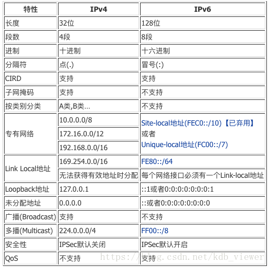
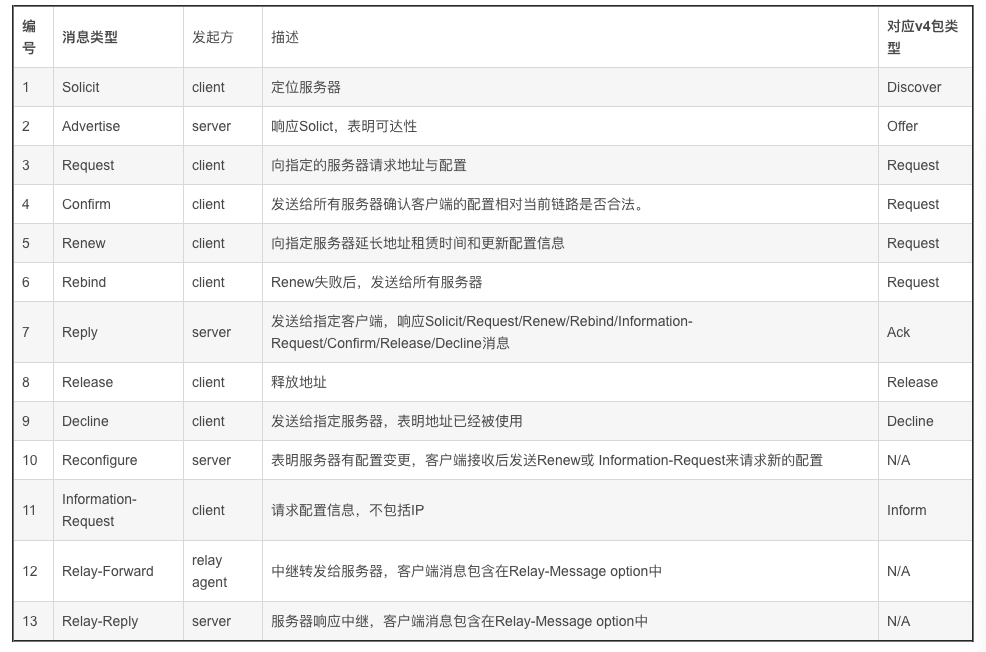

# DHCPV6 vs DHCPV4

1. ## 相同点

- 使用DHCP client, DHCP relay and DHCP server概念
- 使用scopes and leases概念
  - DHCP从一个IP地址池中提供IP地址，该池有DHCP服务器数据库定义，称为scope
  - 
- 使用4个消息包的完整交互 (DHCP for IPv4使用Discover/Offer/Request/Acknowledge (DORA), DHCPv6使用Solicit/Advertise/Request/Reply (SARR))
- 使用DHCP options为终端节点提供附加信息(DHCPv6的type code长度为16-bit)
- 支持Rapid Commit功能

2. ## 差异点

- 标识客户端方式：DHCPv6使用DHCP Unique Identifiers (DUIDs) (RFC 6355),DHCPv4使用MAC地址.
- 消息类型名称不同，大部分功能类似
- DHCPv4基于IPv4包传输，DHCPv6基于IPv6包传输
- DHCPv6使用ICMPv6 Router Advertisement (RA)和IPv6多播消息，DHCPv4使用广播的IPv4消息
- DHCPv6中client与relay/server(RFC 6939)通信时使用link-local地址, DHCPv4使用unsolicited广播地址
- 监听的UDP端口不同, DHCPv4 relay/server监听udp端口67 client监听udp端口68, relay/server监听udp端口547 client监听udp端口546
- DHCPv6 servers提供随机的接口标识符 (避免攻击者侦查), DHCPv4提供scope/pool中的下一个IPv4地址
- DHCPv4可以在路由器上配置, stateful DHCPv6一般不能在路由器上配置
- DHCPv4为客户端提供默认网关地址，DHCPv6不包含这个option，IPv6节点通过ICMPv6 RA消息学习到first hop路由器地址 
- DHCPv4地址池可能耗尽; DHCPv6网段通常为64位耗尽可能性接近0

DHCPV6相关术语：

DUID
    一个角色的DHCP唯一识别符

IA (Identity association）
    分配给客户端的地址集合，有相关的IAID，只保存一种类型的地址，比如temporary地址，每个客户端可能有多个IA，每个网卡一个。

IAID (Identity association identifier）
    每个客户端中的IA不允许存在重复IAID

IA_NA (Identity association for non-temporary addresses)
    存储非临时地址的IA

IA_TA (Identity association for temporary addresses)
    存储临时地址的IA

IA_PD (Identity association for prfix delegation)
    分配给客户端的前缀集合，有相关的IAID，每个请求路由器可能有多个IA，每个网卡一个。

binding
    分配给某个客户端的地址和配置信息的集合，以三元组<DUID,IA-type, IAID>标识。

DHCP domain
    DHCP服务器管理的link范围。

DHCP realm
    DHCP domain的标识

All_DHCP_Relay_Agents_and_Servers (FF02::1:2)
    所有中继与服务器监听的组播地址，被客户端使用

All_DHCP_Servers (FF05::1:3)
     所有服务器监听，当中继不知道服务器单播地址时会使用

Requesting router
     作为DHCP客户端，请求前缀分配 TODO

Delegating router
     作为DHCP服务器，响应前缀分配请求

DHCPV6消息类型：

关于IA：

一、介绍

IA是一个结构体，服务器和客户机用来标识、分组和管理一组相关 IPv6 地址。

每个IA只和一个网口关联。

客户端负责创建IA并指定IAID, 请求服务器为IA分配地址。

每个IA包含一个IAID和相关的配置信息：

IAID相对该客户端必须唯一，且一致，不能因为重启等操作产生变化。
配置信息包含一至多个IPv6地址，IA的T1与T2，每个地址包含prefered lifetime和valid lifetime.
二、选择分配给IA的地址机制

客户端连接的link
直接收到客户端的包，源地址为link-local地址，与服务器接收消息的网卡在同一link上
收到中继转发包，与包中的link-address option标识的网卡在同一link上
直接收到客户端的包，源地址非link-local地址，与包中源地址在同一link上
客户端的DUID
客户端提供的其它信息
中继提供的其它信息
三、临时地址分配

与非临时地址分配没区别，每个IA_TA为link上的每个前缀最多包含一个临时地址，IA_TA与IA_TA的IAID空间独立，值可以相同。

参考: https://blog.csdn.net/kdb_viewer/article/details/83310904

#### ipv4和ipv6的dhcp消息对比

| DHCP v4 (rfc 2131)       | DHCP v6 (rfc 3315)      |
| ------------------------ | ----------------------- |
| C -> broadcast: DISCOVER | C -> multicast: SOLICIT |
| S -> C: OFFER            | S -> C: ADVERTISE       |
| C -> S: REQUEST          | C -> S: REQUEST         |
| S -> C: ACK              | S -> C: REPLY           |

dhcpv6带有快速确认的话
| DHCP v4 (rfc 2131)       | DHCP v6 (rfc 3315)      |
| ------------------------ | ----------------------- |
| C -> broadcast: DISCOVER | C -> multicast: SOLICIT |
| S -> C: OFFER            | S -> C: REPLY           |
| C -> S: REQUEST          |                         |
| S -> C: ACK              |                         |

#### dhcpv6 duid

客户端不再使用硬件地址来标识自己
    发送者： 多种接口，移动，虚拟接口 和 虚拟机
    duid：dhcp唯一id，
    服务端和客户都使用
    初始化DUI的多种方法：DUID-LLT/ET/LT (基于链路层地址，时间和企业编号等)
    

    duid构建方法
    DUID-LLT: 基于链路层地址（如网卡），硬件类型和时间戳
    DUID-EN： 设备制造商的企业号和一个id
    DUID-LL： 链路层地址和硬件类型

duid的挑战：

#### dhcpv6租约和生命期

租约，类似ipv4
生命期：提供的地址有优先的和有效的生命期

