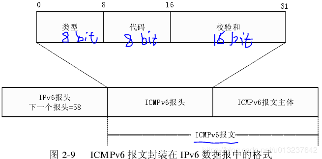

# ICMPv6协议

## 基本功能

在 IPv6 中，ICMPv6 整合实现了 IPv4 中的 ICMP（ping命令）、ARP 以及 IGMP 的所有功能，主要包括错误报告、网络诊断(ping6命令)、邻居发现、多播实现和重定向等。

    iana定义icmpv6的协议号为58
    在IPv6包头中，NextHeader=58则表示IPv6包头后封装着一个ICMPv6消息

ND NI协议也是基于icmpv6

通告网络错误
通告网络拥塞
协助解决故障
通告超时

## 报文

ICMPv6除了具备IPv4 ICMP的基本功能外，还包含以下两个功能： 
（1）组播收听发现协议（MLD，Multicast Listener Discovery）

（2）邻居发现协议（Neighbor Discovery）

    5条icmpv6消息
    路由器通告消息 router advertisement type134
    路由器请求消息 router solicitation  type133
    邻居请求消息 neighbor solicitation  type135
    邻居通告消息 neighbor advertisement type136
    重定向消息 redirect type137

### 路由器发现 router discovery

用于定位邻居路由器，生成default router列表，并获取与地址自动配置有关的前缀和配置参数。用RS RA机制实现

- 主机发送RS报文 ICMPv6 type=133 src=link-local address FE80::/10 DST=all-routers 组播地址 FF02::2
- 路由器回应RA报文 ICMPv6 type=134 Src = router 本地链路地址 Dst= all nodes 组播地址 FF02::1 Data=router lifetime, cur hop limit, autoconfig flag, options(prefix,MTU)...
- 主机从RA报文获得前缀及其他参数

### 地址解析 address resolution

IPv6取消了ARP协议，通过邻居请求报文NS和邻居公告报文NA的交互来解析链路层地址

**类型**域为8位，用来表示消息的类型，如果最高有效位是0（即值的范围是0-127），则表示一个错误消息；如果是1，则该ICMPv6包是一个信息消息。

|                    |              |                                                              |
| :----------------: | :----------: | :----------------------------------------------------------: |
|        类型        |  代表的意义  |                           详细描述                           |
| **ICMPv6错误消息** |              |                                                              |
|         1          | 目的地不可达 |                 通知源地址，不能发送数据包。                 |
|         2          |  数据包太大  |               通知源地址，数据包太大无法转发。               |
|         3          |     超时     | 通知源地址，IPv6数据包的“跃点限制”[[2\]](https://zh.wikipedia.org/wiki/互联网控制消息协议第六版#cite_note-2)已过期。 |
|         4          |   参数问题   |     通知源地址，在处理 IPv6报头或 IPv6扩展报头时发生错误     |
|        100         |     实验     |                                                              |
|        101         |     实验     |                                                              |
|        127         |     保留     |                                                              |
| **ICMPv6信息消息** |              |                                                              |
|        128         |   回显请求   |             用来确定 IPv6节点在网络上是否可用。              |
|        129         |   回显应答   |                     对“回显请求”的应答。                     |
|        133         |  路由器请求  |                    对“路由器请求”的应答。                    |
|        134         |  路由器公告  |                    对“路由器公告”的应答。                    |
|        200         |     实验     |                                                              |
|        201         |     实验     |                                                              |
|        255         |     保留     |                                                              |

全球单播地址（例如2000::/3）

链路本地单播地址的前缀为FE80::/10，表示地址最高10位值为1111111010

IPv6组播地址：由前缀、标志（Flag）字段、范围（Scope）字段以及组播组ID（Group ID）4个部分组成

二、邻居发现协议NDP

    邻居发现协议NDP是通过 Internet 控制报文协议（ICMPv6）报文来承载的；在一个IPv6数据报中，如果该数据报的“下一个报头”字段的值为 58，且 ICMPv6 报文中类型字段取值范围为133-137，则此IPv6报文的数据部分含有邻居发现协议报文。

1、路由请求报文（Router Solicitation Message，RS）

2、路由通告报文（Router Advertisement Message，RA）

3、邻居请求报文NS（Neighbor Solicitation Message，NS）

### 参考资料：

- [RFC4443](https://tools.ietf.org/html/rfc4443)  ICMPv6 
- [RFC4861](https://tools.ietf.org/html/rfc4443)  NDP 邻居发现

