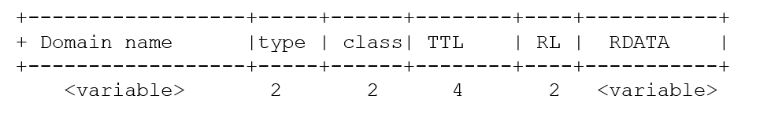

# DNS  IETF-63总览

- 适合阅读人员:刚接触DNS的新手

## DNS 数据模型

- DNS 是一个全球性的“松散一致性”委托代理实现的数据库
  - 委托实现 -> 内容为本地控制
  - 松散的一致性-> 共享信息(在保证一致性下 ),因为数据需要同步到缓存服务器等其他服务器，同步的时候有缓存超时机制，超时后才开始重新同步， 所以需要时间去完成同步
    - 不需要是一致的或者是最新的.
    - 在“域名”的所有者负责用自己的数据提供服务的环境下,实现全球操作. 
  - 网络中传输的数据是二进制的
  - [A-Z][a-z]的字符范围的域名是大小写不敏感的
    - 其他的大小写是敏感的
  - 域名的取值范围是[A..Z0..9-] RFC952 
    - 在取值范围内的域名是可以被使用的
    - IDN(Internationalized Domain Names)在非美国的ASCII下提供标准的域名编码规范

## DNS树

## DNS词汇

- 域名: 任何使用DNS格式来表示的名字 
  - foo.bar.example.
  - \0231br.example.
- DNS标签
  - 被两个 “.”分隔的字符串,除非点是在”\”前缀之后
    - 例如 foo.bar 是两个标签而 foo\.bar是一个标签
- DNS区
  - 在同一权威下面的名字集合
    - 假设某个权威DNS服务器下面有example.com 和 ftp.example.com, www.example.net这个几个域名文件提供权威应答服务,那么这三个域名就是同一权威下面的名字
  - 区可以比标签有更深的层次, 例如 .us, baidu.com
- 代理
  - 一个域名的授权代理
    - example.org 是来自于 org 的委派代理
    - 可以使用词parent 和 child 来描述关系

## 更多的DNS词汇

---

- RR: 一个单独的资源记录Resource Record
- RRset: 一个名字下具有相同资源类型的所有记录
  - 服务器最小的传输单元

- TTL: 一个RRSet被非权威服务器缓存或者重用的时间阈值

## DNS角色

- 解析者
  - 基本的名称解析器(stub resolver): 简单的,只有查询功能
  - 递归: 使用简单查询和足够的步骤次数来获取完整的答案.

- 服务提供者
  - 权威的: 为区管核着区文件的服务器, 可以是一个主的,一个或者多个附属的. 
  - 缓存: 一个存储着先前的结果并复用的递归解析者 
  - 有些同时承担着两个角色. 

## DNS查询模式

- DNS是一个 “查询服务"
  - 简单查询--> 简单答复
  - 没有搜索,比如不能返回一个a.com到e.com的所有的子域名内容
  - 没最合适的答案，要么有结果，要么没有结果
  - 受限的数据扩展能力,主要是域名的字符串长度:国内域名每一级长度不得超过20个字符；国际域名每一级域名长度的限制是63个字符，域名总长度则不能超过253个字符

- DNS 成功的原因

  - 简单的
    - “神圣”两Q一体: QNAME, QTYPE
  - 干净的
    - 直接的授权代理
      - 父节点是授权的委托主体,
      - 子节点是授权内容的被委托者.

  ## DNS 网络传输上的协议

- 传输:
  - UDP  512 字节的负载(Payload),以 TCP 做后备
  - EDNS0 (OPT RR) 在共同的确认同意下扩展UDP负载大小. 
  - TSIG 单对单的认证和完整性,认证是指接收这可以通过tsig确认发送者的有效性.完整性是tsig指在发送的DNS数据包里面做了一次校验,校验的时候使用了tsig,使得接收者可以确定这个包没有被篡改过.
- 重传 :
  
  - 将超时查询重新发送到其他服务器. 

## DNS RR 网络传输格式

- 拥有者名称(domain name)
  - 如标签的序列化般编码
    - 每个标签包含
      - 长度 (1字节)
      - 名称(n 字节[1..63])
      - ogud.com   04ogud03com00
- type : MX, A, AAAA, NS …
- CLASS:  IN (other classes exist but not global)(因特网)
- TTL: 缓存存活时间
- RL: RD LENGTH: RDATA的长度
- RDATA: RR的内容
  - Binary blob, no TLV. 

## DNS 查询

- QNAME: www.ietf.org
- QCLASS: IN
- QTYPE: A

## DNS 查询模式

- **查询 -> 应答 **

桩(stub)解析服务器 如果有答案就应答之前的应用. 

## DNS 资源类型

- DNS 内部类型
  - NS, SOA, DS, DNSKEY, RRSIG, NSEC
    - 只给DNS操作使用
- 间接 RR: 
  - CNAME,
    - 内部的DNS RR使得解析者改变搜索的方向
      - 服务器必须有特别的处理代码
- 终结的RR:
  - 地址记录
    - A, AAAA,
  - 信息
    - TXT, HINFO, KEY, SSHFP
      - 将信息传输到应用
- 非终结的RR:
  - MX, SRV, PTR, KX, A6, NAPTR, AFSDB
    - 包含着会引导到更深层次的查询的域名.
- META: 
  - OPT, TSIG, TKEY, SIG(0)   
    - 不在DNS区里面存储,只出现在网络传输中

## DNS操作

- DNS区在权威服务器上加载

  - 服务器通过在SOA信息里的RR via AXFR, IXFR或其他方法保持同步.AXFR和IXFR分别表示完全区域传输和增量区域传输.主要用在主附DNS服务器同步的时候.

- DNS缓存保持数据在一个”很短”的时间里

  - 通过RRset上的TTL来定义. 

- ?DNS解析服务器在缓存查询数据的时候，使用最长匹配模式查询?，然后跟随委派引导，直到收

  到一个正面的应答或者拒绝应答. 在包里面表达了

  - DNS数据包很小
  - DNS当服务器可达的时候，传输是非常快的.
  - ?Tree climbing == BAD
  - ?很少的应用会这样定义，当域名的RR记录不存在的时候，就会去寻找apex?默认的区， 
    - ?桩(stub)解析器对于Zone cut是很难查找到的, 
    - ?命名的结构划分没必要应用于网络管理的结构划分.
    - ?虽然DNS的命名空间是等级划分的, 但是没有继承区域范围的默认值也不好，源于“apex重载”

## DNS 不足之处

- 包的大小: 
  - 512是标准的DNS字节数, ?4K+ for EDNS0 
  - 保证RRsets足够小是一个非常好的习惯. 
- 无效的授权委派:
  - 在域名服务器上父节点和子节点都必须保持同步.
  - 副服务器必须以主服务器为主保持更新. 
    - 问题灾区: permissions, transfer protocol not getting through, clock synchronization, old/renumbered primary/secondary.      
- 数据完整性:缓存投毒
  - 在特殊情景下，如果数据流是可见的，那么DNS，应答可以被伪造. 
- 损坏/旧的DNS: 
  - 小百分比，但保持着原始功能

## DNS API问题
- 所有的或者没有一个RRset到达
  - 以混乱的顺序到达
- DNS解析服务器应该
  - 如果已经知道权重的顺序，返回明确的有序的DNS RRset
  - 其他RRsets 可以在返回报文中以随机顺序排放
- ?DNS 数据应该存放在一个个单独的位置:表示一个域名只能在一个区里面管理,不能在别的区里面.
  - ?在name或者<prefix>.name 
  - 全区默认值
    - 没有区域范围的默认值，因为“区”是用于管理的人工边界

## DNS 通配符: 最混乱的地方: FACTS

- ?只匹配不存在的名字
- ?扩展是被存在的名字终结
  - 不要超出区域边界

## DNS 通配符: 最混乱的地方: MYTHS

- 记录: 

  *.example MX 10 mail.example

  - 匹配任何在example中的域名!!
  - 为存在的名称提供RR类型，缺少MX RRs. 
    - 是否需要在域名解析里面添加MX RRset

  - 只扩展一层
- www.*.example 将会扩展

## 通配符匹配

- 区的内容: 

  *.example. TXT "this is a wildcard" 
  www.example. A 127.0.0.1
  jon.doe.example. A 127.0.0.2

- 域名“doe.example”存在, 没有任何的RRtypes=> 空的非终结符

- Name “tina.doe.example.” 不会从通配符展开

- Name: “tina.eod.example.” 匹配.

## SRV资源

- ?最常用在MS激活目录
  - 也用于一些IM 应用如Jabber. 
- 拯救任务: 提供名字为 COOL的(新的)服务, 需要给它提供
  - 旧的解决方法: 别名 "ftp", "www", ...
  - 问题: 需要大家知道的端口, 没有例外情况;
    - 单个目标（服务器）或近似均匀分布在多个地址上

## MX概括: that COOL SRV

- SRV记录了哪台计算机提供了哪个服务这么一个简单的信息.
  
- COOL service in example.org
  \_cool._tcp.example.org  SRV  0  0 5133 srv55.mega.example 
  \_cool._tcp.example.org  SRV 10 20 9876 srv33.mega.example.

  \_cool._tcp.example.org  SRV 10 20 3456 srv44.mega.example.
  \_cool._tcp.example.org  SRV 10 40 6738 srv66.mega.example.
  “_” 避免和主机名字冲突

- 服务需要被注册

  - 目前正在讨论的:分开的注册
  - 这对本地服务的定位不太好 (-> 爬取树)

## 什么时候使用SRV

- SRV 在下面环境工作的最好:

  如果你有一个TCP或者UDP的服务并且能够代理和分布式部署

- SRV 是被广泛应用和支持的. 

## NAPTR

- 其他常见的任务: 将名字映射到URL
- SRV不起作用
  - 没有本地部分
  - 没有可变的策略
- Naming Authority Pointer: NAPTR
  -  order		16 bit value
  -  preference	16 bit value
  -  flags		character-string
  -  service		character-string
  -  regexp		character-string
  -  replacement	domain-name

## NAPTR and beyond: DDDS

- NAPTR 嵌入在一个完整的框架中
- DDDS == Dynamic Delegation Discovery System
- 已经使用在ENUM 和 ONS (the RFID name space)
  - 这些创建了他们自己的命名空间

## S-NAPTR

- 将SRV 和 NAPTR融合一起
- 避免应用程序特定的DDDS的开销
- NAPTR 引导出更多的NAPTR 或者 SRV
- SRVs 引导到 A (或者AAAA)

## DNS 历史问题和解决方案:静态数据

- DNS 更新(RFC2136): 
- 添加了大量使用的运行时更改DNS内容的能力。
- 因为操作的原因,很难于新增或者修改数据. 
  - DNS 安全更新(RFC3007) 具体指定了如何安全的委派更新DNS名字或者名字/类型的功能

## DNS 历史问题和解决方案: 未知的RR类型

- 早期的DNS 实现了RR类型的硬编码. 
  - 未知的 RR 将被一些解析器所丢弃
  - 未知的 RR没有被权威服务器拿来提供服务
    - 暗示: 花费很长时间来介绍新的RR类型.
  - 解决方案: 
    - RFC3597 定义了所有的服务器和解析器必须支持如下
      - 支持未知的RR类型和规则,并用来定义他们.
      - 建议为它们设置一个常用的编码表示. 
  - 部署: 
    - BIND-9, BIND-8.2.2, ANS, CNS, MS DNS-2003, DNSCache, NSD, PowerDNS, Net:DNS, DNSJava, etc. 

## 当前DNS基础设施问题

- 旧的应用仍然作为权威服务器或者缓存服务器存在着
- Middle boxes使用旧的 DNS 软件或者他们自己损坏的DNS. 
  - 一些负载均衡器做了些愚蠢的事情. 
  - 应用程序接口拒绝请求未知类型

- 大量的基础设施
  - 开启支持 RFC3597
  - 开启支持 EDNS0
    - TCP DNS 查询经常被阻塞掉. 
- “Are you affected” 的简单测试: 
  - http://stora.ogud.com/DNSSEC/unknown/index.html
    - Right now shell scripts, soon a java applet.

## DNS 操作问题

- 很低的TTL: 如果 TTL 是很低的,RRset 只会缓存很短的时间,频繁的查询是需要的:
  - 负面影响: 在自身和基础设施上存在DoS漏洞,查询比较缓慢, 
  - 正面影响: 快速的动态调整和允许原始的负载均衡Highly dynamic and allows primitive load balancing
- 糟糕的代理: 
  - NS 在父节点上过时
  - NS包含随机数据以克服注册要求
- 在供应商建议退休后仍然在使用的旧的软件

## DNS操作

- ?添加一条数据到反向的树结构是有问题的
- 因为大家如下所说,导致添加RR 类型是不可接受的
  - 没有被我们的软件支持
    - 部署,权威服务器,解析器,防火墙,中间件, 
      - 你选择. 
  - 感觉不需要它
    - 地盘争夺, 政治….
    - …..

## DNSSEC(Domain Name System Security Extensions): DNS的数据完整性和身份验证

- 角色: 保护DNS	
  - 如何实现: 站在10公里外来看看.
    - DNS RRset由它所属的区域来签名。
    - 区域DS RRset由父区域来担保。
- DNSSEC 不会做些什么: 
  - 使得DNS中的数据更加正确. 

## DNSSEC:更多细节

- 数据保护
  - 在每一段时间里面,DNS RRset里面的每一条记录都包含了一条来自于区的私钥签了名的特殊RRSIG信息.
  - 存在的证明
    - NSEC记录链列出区域中的所有名称及其RR类型。 (确证/否认存在) 
  - 父节点给子节点做签过DNSKEY 的私钥的指纹的签名.(DS RR)
    - 允许从一个安全的父区传输到一个安全的子区. 

## DNSSEC:影响

- 区
  - 变得更大
  - 需要定期维护
  - 需要对密钥进行管理
- 解析器需要知道安全的入口点来对子树进行签名.
  - 随着时间变化，需要更新。 
- 只支持小部分的应用程序. 
  - BIND-9, DNSJava, Net:DNS, NDS, ANS, CNS

## DNSSEC给应用程序提供了些什么?

- ?可以进行签名确认的RR set(s)的DNS应答,是周知的与预定区域相同	. 
- DNSSEC的广泛部署,允许应用程序往DNS里面存放更多的重要数据. 
  - 未签名的密钥信息
    - IPSECKEY, SSHFP
  - 防止进行服务位置欺骗
  - 其他... 

## DNS 子类型问题

- DNS 响应必须包含完整的RRSets
  - 你不能查询RRSet的一个子集
  - 也不能部分匹配 (只匹配QNAME, QTYPE, QCLASS)
- 你不能要求，比方说，一个名字最多8个地址记录（A RRs），或者只要求那些优先级为10的MX RRs，或者所有包含“monery”的TXT RRs。
- 有些RR 类型是“容器”,例如
  - KEY	(the original)
  - NAPTR
  - TXT	(with the RFC1464 convention)
- 子类意味着应用程序必须从响应中选择他们的RRs,有可能大部分的丢弃RRSet,取决于一个或者多个在RDATA隐藏的二级限定符. 
- ENUM NAPTR超载

## 子类型副作用

- 子类型导致更大的响应
- (浪费带宽) [大的RRsets 通常是一个DDoS vector]
  - 截断的危险
  - 基于TCP的重查询

- 在设计新类型的时候应该避免使用子类型

- 子类型可以通过以下方式避免
  - 用专门的类型来替换类型或者子类型
  - 选择器前缀（cf SRV）

- 方法的选择取决于期望的子类型的数量还有性质, 还有处理通配符的必要性

## 在DNS中放置新信息的设计选择

- 新类
  - 你需要为它提供root服务器
- 新的后缀
  - 根ICANN商谈 
- 重用TXT (或者其他类型)
- <prefix>.name
- 新类型

## 在DNS中放置新信息: 重用存在的类型

- TXT可能是显而易见的选择
  - 没有语义
  - RFC 1464 subtyping
  - 前缀可能有用, 但是有它子集的问题
  - TXT浪费空间, 这个也很重要
  - 如果新的RRSet是很大的你需要DNS0来支持
    - 现代的软件就是这样做的,未知类型也是这样做的!!!!	
      - 道德: 争取本地更新,不强迫整个因特网解决这你的本地问题.

## 在DNS中放置新信息: 名字前缀, magic name
- 在域名前面（下面）放置选择器: 
  - _axfr.example.org APL 1:127.0.0.1
  - 可能干预到区维护者的命名策略
  - 前缀会在不同的区结束
  - 通配符不会向期望那样工作了, 也就是 _prefix.*.example.org 不再扩展
  - 前缀没有注册
- Magic name, 例如www
  - 在单个应用程序服务器中重载多个名字.
  - 再一次可能和命名策略相冲突

## 新类型的好处

- 对内容的完全控制
- 以应用程序为中心的语义
- 更易于应用程序的分析
  - 如果你的明细是简单的
- 没有碰撞,更小的

## 逐步的新类型

- 考虑“逐步” 这个词
  - 不要过度处理这个问题
  - 当你设计新的RR类型与现有的命名空间一起使用的时候
    - 在一个名字里缺失了的类型是什么意思呢? 确定好:
      - 特征是无效的
      - 特征是不支持的
      - 使用应用程序默认值

## 如何获取一个新的DNS类型

- 规定 (查看RFC3597)
  1. 没有additional section处理
  2. 没有嵌入了压缩域名的名称
  3. 定义清晰,没有过于复杂的结构

- 处理过程: 
  1. 写一个ID,让了解你协议的人来审查,更新草案.
  2. 让DNS专家(WG主席)快速审阅,更新ID
  3. 让 WG(s)审阅
  4. 提交到IESG, 在IESG处理后你从IANA获取到类型编码
  5. 公布新的类型编码

## 如何启用新类型? 

- 保证你的:
  - 软件是”现代的”
  - 中间件不会妨碍和/或被更新. 
- 提供工具到
  - 将新的RR类型从文本格式转换为RFC3597可移植格式以进行区域包含, 
  - 执行新类型的动态更新. 
    - 好的工具: Perl NET:DNS, DNSJava, 
- 现代的服务器: 
  - Bind-9, MS DNSServer2003, NSD, PowerDNS, ANS, CNS

## 被认为是恶魔的优化

- 问题:
  - 经常的,非终结的记录建议需要,终结记录在应答中返回==> Additional section 处理
- 事实: 
  1. 在服务器里面Additional section 处理已经完成
  2. 在部署更新的服务器之前,RRtype会提示解析器需要完成所有工作. 
  3. 不是所有权威服务器都有必要的粘合器
  4. 粘合器可能不合适
  5. 递归解析器可能已经有数据了
  6. 往返是廉价的, 
  7. Lacy解析器编写器将假设完成了额外的部分处理
- 结果: 
  - 递归解析器必须能够永远工作, 
- 总结: 不要试图去优化DNS,那会导致问题的. 