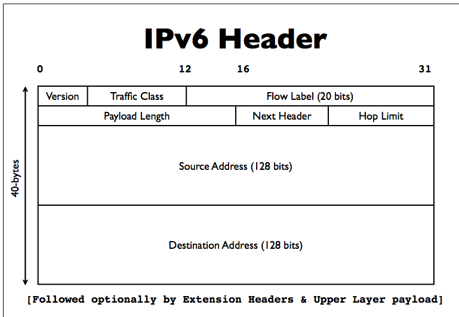

# IPv6引言 (基础知识)

## ipv6动机

全球推进IPv6官网  http://www.worldipv6launch.org 
2012年6月6日，主要的因特网服务提供商(ISPs)，网络设备制造商，和web公司聚集在一起，宣布他们的产品和服务永久支持IPv6

- 主要的公司有：谷歌 脸书 奈飞 雅虎 微软必应...
- ISP: Comcast, AT&T, Free Telecom, 时代华纳...
- CDN: Akamai, Limelight等
- 一些大学，公司，政府组织...

目前进展：西欧和美洲等发达国家进展迅速

进展网站: http://www.google.com/intl/en/ipv6/statistics.html

### IPv6介绍

- 下一代因特网协议
- 更大的地址空间 128位vs 32位的IPv4
- 没有NAT(目标: 恢复端到端的体系模型)
- 可扩展的路由(后续介绍)
- 其他: 协议头部的简化, NDP(ARP的更好版本), 自动配置, 流标签
- 备注: IPv6不向后兼容IPv4
- 最重要的目标是大的多的IP地址空间
- IPv4地址已经耗尽，但是因特网在持续增长
	- 用户和连接到网络的设备都在增长
	- 物联网，设备会越来越多
- 不部署IPv6的后果：
  - 购买IPv4地址花费巨大
  - 2011年，微软购买北电的60万个ip地址，花费750万美元，每个IP地址约11.25美元
  - 2011年，每个IP地址约12美元
- NAT的层级越来越多, 巴尔干化(碎片化)，导致全球互联的失败

### 迁移还是共存

- IPv4不会快速消失，可能还会存在很多年
- 因此，对大多数已经连接到IPv4互联网络的人来说，不会迁移到IPv6
- 我们要部署IPv6来和IPv4共存
- 我们要和IPv4和IPv6的互联网互通

### IPv6的简单历史

- 1993年 IETF开始设计工作
- 1999年完成
	- RFC 1883 IPv6规格的第一版(1995年12月) 
	- RFC 2460 IPv6规格(1998年12月)
	- IPv6规范，最新的是RFC 8200
- 1999年4月，IPv6的地址空间有了第一个RIR分配
- 截止目前，有数百个RFC存在，描述IPv6的各个方面和它的各种应用
- IPv6还在发展

### IP地址分配

- IANA负责分配最顶级的IP地址块，一般分配给地区级的因特网机构(RIR regional internet registries)
- 5个RIR 负责不同的地理区域(ARIN北美 RIPE欧洲 LACNIC拉美 APNIC亚太 AFRINIC非洲)
- RIR分配个大的ISP和一些大的组织
- 大的ISP分配给小一些的单位(其他ISP或企业)
- IPv4地址已经耗尽

### 部署IPv6需要我们做什么

- 从ISP获得IPv6地址空间
- 用IPv6连接到你的ISP
- 在网络设施中部署IPv6 包括操作系统和应用程序 可能需要升级
- IT员工和客户服务的培训工作

## IPv6地址结构和协议详情

### IPv4地址

如192.168.7.13
- 32位
- 用句号分隔
- 4个8位数字
- 2的32次方 约是43亿个地址

### IPv6地址

- 128位
- 8组16位，用冒号分隔
- 2的128次方个可能的地址
一个IPv6地址的例子: 2001:0db8:3902:00c2:0000:0000:0000:fe04

### IPv6的经典格式

RFC 5952 IPv6的文本表示法
- 去掉前缀0
- 连续4位都是0可压缩为0
- 选取最长的全0压缩为::, 每个IPv6地址只能有1个::
- a-f必须是小写字母
  完整的IPv6地址 2001:0db8:3902:00c2:0000:0000:0000:fe04
  压缩后的IPv6地址 2001:db8:3902:c2::fe04

### ipv4映射到ipv6

详情可参考 RFC 4038
在ipv4地址前，增加前缀  ::ffff:0:0/96 (0:0:0:0:0:ffff:0:0/96)
96是网络段的数字位数 128-96=32位IPv4地址
    ipv4地址 ::ffff:192.0.2.124

### ipv6用到url中

[]包起来IPv6地址
http:// [2001:db8 : ab : cd : : 3]:8080/index.html
RFC 3986

### ipv6网络前缀

• 格式: IPv6地址 / 前缀数字位数

•2001:db8::/32
•2001:db8:ab23::/48 (典型的组织分配级别)

•2001:db8:ab23:74::/64 （大部分的子网）

•2001:db8:ab23:74::2/64 

•2001:db8:ab23:75::1/127 (p2p链接)

•2001:db8:ab23:76::a/128 (回环地址) 

### ipv4头部

#### ipv6头部

