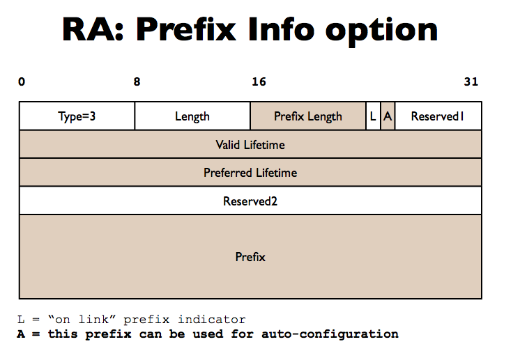
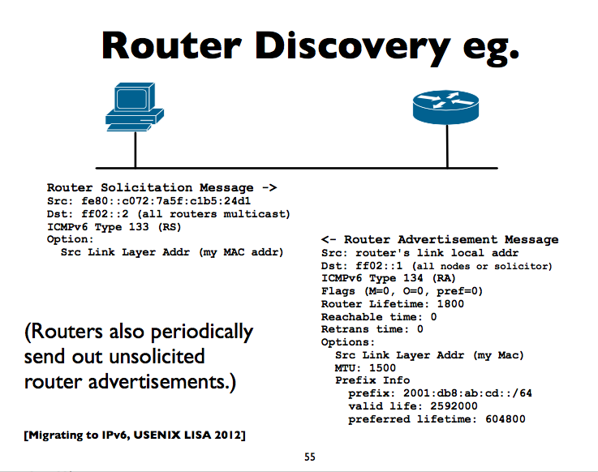

2019-11

#### ipv6网络前缀

• 格式: IPv6-Address / prefix-length 

•2001:db8::/32
•2001:db8:ab23::/48 

•2001:db8:ab23:74::/64 

•2001:db8:ab23:74::2/64 

•2001:db8:ab23:75::1/127 

•2001:db8:ab23:76::a/128 (loopback) 

#### ipv4头部

#### ipv6头部

#### ipv6地址类型

单播
组播
任播

单播本地链路地址（前缀为ff80::/10）、
单播本地站点地址（前缀为FEC0::/10）、
单播未指定地址（：：/128)、
单播环回地址（：：1\128）
内嵌IPv4地址的IPv6地址。

#### 单播地址类型

全球唯一地址

​	静态，SLAAC，dhcp配置的

​	管道地址（6to4,teredo,isatap,...)

​	其他（CGA,HIP,...)

本地链路地址

唯一本地地址（ULA unique local addresses)

Loopback (::1)

未指定 (::)

#### 链路地址

所有的ipv6网络接口有一个本地链路地址

特殊的地址被用来在本地子网通信

自己配置是在Fe80::/10范围（实际是fe80::/64)

最后64位是基于mac地址（EUI-64)

在多种物理接口上，地址可能相同

在不同的接口上，用scope-id覆盖

## ipv6介绍

128位数字

ipv6地址格式
48位 全局路由前缀 + 16位 子网id + 64位 接口id

    2001:0db8:3902:00c2:0000:0000:0000:fe04
    2001:db8:3902:c2::fe04

#### ipv4映射到ipv6

前缀  ::ffff:0:0/96

    ipv4地址 ::ffff:192.0.2.124

#### ipv6用到url中

http:// [2001:db8 : ab : cd : : 3]:8080/index.html
RFC 3986

#### 反向dns  rdns

    in IPv4, PTR records
    
    Uses “ip6.arpa” subtree (IPv4 uses “in-addr.arpa”)

#### 组播地址

组播：一种有效的一对多通信形式

一个特殊的ipv6地址前缀 ff00::/8, 标识组播组地址

希望收到组播数据的主机，加入到相关联的组播组

有范围（链路，site，global等）

在ipv4，igmp协议负责加入和离开组

在ipv6，对应的协议是MLD (multicast listener discovery)

参考：

[RFC 2375 – IPv6 Multicast Address Assignments](https://datatracker.ietf.org/doc/rfc2375/)

https://ccie.lol/knowledge-base/frequently-used-ipv6-address/

• In IPv4, the group joining and leaving protocol is IGMP

• In IPv6, the protocol is MLD (Multicast Listener Discovery)

#### ipv6 子网 subnet

一般是64位

IPv6 寻址结构 Addressing Architecture (RFC 4291) 要求主机部分是64位
从MAC地址生成唯一的64位

SLAAC (StateLess Address AutoConfiguration) RFC4862

#### Neighbor Discovery 邻居发现
RFC 4861
与IPv4的arp类似，提供更多功能

路由发现 router discovery

子网前缀发现 subnet prefix discovery

重复地址检测 duplicate adderss detection

邻居不可达检测 neighbor unreachability detection

#### 邻居发现消息 neighbor discovery messages

5种 ICMP6消息类型

    router solicitation 路由请求
    router advertisement 路由器通告
    neighbor solicitation 邻居请求 （类似 arp请求)
    neighbor advertisement 邻居通告 (类似 arp应答)
    redirect 重定向

#### solicited node multicast 被请求节点的组播地址

ND 邻居发现是在本地网络寻找其他的主机和路由器，ipv6没有广播

ND使用被请求节点组播地址（把本地网络上的主机分成不同的组，每个组对应一个不同的组播地址）
    Solicited-Node多播地址按如下方法形成：取地址(单播或任播)的低阶24位，把这些位挂到前缀FF02:0:0:0:0:1:FF00::/104上，产生从FF02:0:0:0:0:1:FF00:0000到FF02:0:0:0:0:1:FFFF:FFFF范围内的多播地址。

对一个主机拥有的每个ipv6地址，加入到对应的多播地址组

#### EUI-64地址的计算

Extended Unique Identifier (扩展的唯一id)

48位的mac地址，前后24位分开

ff:fe 插入到中间

左边数，第7位数字翻转（0改为1，1改为0)
形成了64位的EUI-64地址

#### 自动配置
rfc4862 SLAAC
host 在本地子网监听路由器通告消息 RA
从RA 获得64位的子网前缀
根据自己的mac地址，计算修改过的EUI-64，并且连接到从RA获得的子网前缀后面，形成ipv6地址

#### 路由通告消息格式

    type=134, code=0,         checksum
    
    cur hop limit, M O H Pref P R R,  router Lifetime
    
    reachable time
    
    retransmission timer
    
    options (source link layer, mtu, prefix information)
    
    M = managed config flag "使用有状态 dhcpv6"
    
    O = other config flag
    
    Pref = default router preference  rfc4191

#### RA: prefix info option 路由器通告 前缀信息选项

----------
    type = 3, length, prefix length, L A 保留
    
    valid lifetime
    
    preferred lifetime
    
    保留2
    
    前缀

------

L = "on link" prefix indicator

A = 这个前缀能被用来做 自动配置

#### 路由器发现  举例

#### 邻居发现 举例

#### SLAAC & 私密信息？

SLAAC 把主机的mac地址暴露给了全世界

ipv4，mac地址只暴露给本地子网

#### 临时地址

rfc 4941 slaac的私有信息扩展

临时地址或私有地址的地址池

todo

#### dhcpv6

- stateless DHCPv6 rfc3736
- 有状态 DHCPv6 rfc3315
-     --- 与ipv4类似的，受管理的地址分配
-     --- 容易让dns和rdns流行

#### 有状态 dhcpv6

    rfc3315
    概念上，类似ipv4的dhcp
    RA的M标志被设置 （managed configuration)
    需要dhcpv6服务器，发送租约信息给客户端

与ipv4 dhcp的不同：

    udp 端口 546（server） 547（client）
    试试
    客户端使用自动配置的本地链路地址作为source
    客户端发送消息给组播组地址（ff02::1:2) ipv4使用广播
    不分配默认网关，使用RA （路由器通告）
    dhcp服务器能给客户端发送“重新配置”消息
    快速确认选项（4个消息减为2个）
    duid （dhcp unique id）
    提供临时和非临时地址

#### ipv4和ipv6的dhcp消息对比

DHCP v4 (rfc 2131) | DHCP v6 (rfc 3315)
---|---
C -> broadcast: DISCOVER | C -> multicast: SOLICIT
S -> C: OFFER | S -> C: ADVERTISE
C -> S: REQUEST | C -> S: REQUEST
S -> C: ACK | S -> C: REPLY

dhcpv6带有快速确认的话
DHCP v4 (rfc 2131) | DHCP v6 (rfc 3315)
---|---
C -> broadcast: DISCOVER | C -> multicast: SOLICIT
S -> C: OFFER | S -> C: REPLY
C -> S: REQUEST | 
S -> C: ACK | 

#### dhcpv6 duid

客户端不再使用硬件地址来标识自己
    发送者： 多种接口，移动，虚拟接口 和 虚拟机
    duid：dhcp唯一id，
    服务端和客户都使用
    初始化DUI的多种方法：DUID-LLT/ET/LT (基于链路层地址，时间和企业编号等)
    

#### dhcpv6 duid

    duid构建方法
    DUID-LLT: 基于链路层地址（如网卡），硬件类型和时间戳
    DUID-EN： 设备制造商的企业号和一个id
    DUID-LL： 链路层地址和硬件类型

duid的挑战：

    当我们希望获取mac
    关联ipv4和ipv6地址
    在一些设备上持久化存储

#### dhcpv6租约和生命期

租约，类似ipv4
生命期：提供的地址有优先的和有效的生命期

#### 无状态dhcpv6

    在RA消息的O标志，（路由器通告消息）
    客户端--> 组播地址：INFORMATION_REQUEST
    服务端--> 客户端： REPLY 应答

#### dhcpv6选项

    无状态和有状态dhcpv6都需要用到
    一些常用的option
    dns 递归命名服务器 recursive nameservers
    dns 搜索链表
    ntp服务器
    sip服务器
    前缀代理 rfc3633
    and etc.

#### dhcpv6 其他

其他消息： renew，rebind，confirm，release，decline，reconfigure
类似ipv4，支持中继代理 relay_forw, relay_repl
服务器失效协议
    v6暂未实现
前缀代理

#### 有中继代理的dhcpv6

client | relay | server
---|---|---
->solicit | -- | --
-- | -> relay-forw(solicit) | --
--  |  -- | < - relay-repl (advertise)  
--  |  < - advertise | --
--> request  |  -- | --
--  |  --> relay-forw(request)  | --
--  |  -- | < -- relay-repl(Reply)
-- | < -- reply | --

#### 其他的配置可能性

新的路由器通告选项

    rfc6106: RA options for DNS 配置
    允许通过RA传输 dns服务器和相关的信息
    暂未实现。。

#### ULA (unique local address)

    rfc 4193, fc00::/7前缀
    替代ipv4的私有地址
    老的fec0::/10过期了
    
    prefix（7bits) L（1） global id(40) subnet id(16) interface id(64)
    prefix: FC00::/7来标志 本地ipv6单播地址
    L 设置为1，如果前缀是本地分配的，0：保留使用
    global id， subnet id ，interface id, 参考ipv6

#### mac/win/linux 上的ipv6地址

    $ ifconfig -a

#### linux RA 示例

    RA 路由器通告
    $ /sbin/ip -6 addr show dev eth0

#### 常用的ipv6分配机构

    < /32  地区代理或大的代理商
    /32  局域的代理或代理商
    /48  大多数的企业和终端网站，允许65536个/64子网
    /56  小的sites，地区级服务商。允许256个/64子网
    /64  本地服务
    rfc6177

## 网络服务提供商的ipv6支持

    大洲级，移动商，地区级，

## 操作系统的ipv6支持

win，mac， linux etc，安卓， ios

## 应用软件的ipv6支持

    apache iis
    sendmail, postfix, ms exchange,
    dns: bind, powerdns...

#### 一些应用的配置

    dns: isc bind
    dhcp: isc dhcp
    apache
    web 浏览器
    smtp: sendmail

## ipv6 管道

    6to4和Teredo

#### 6to4

    主机和网络都有2002::/16前缀    
    6to4路由器在ipv6网络的ipv4网络的边界
    6to4中继路由器

#### 6to4寻址示例

​    
​    

